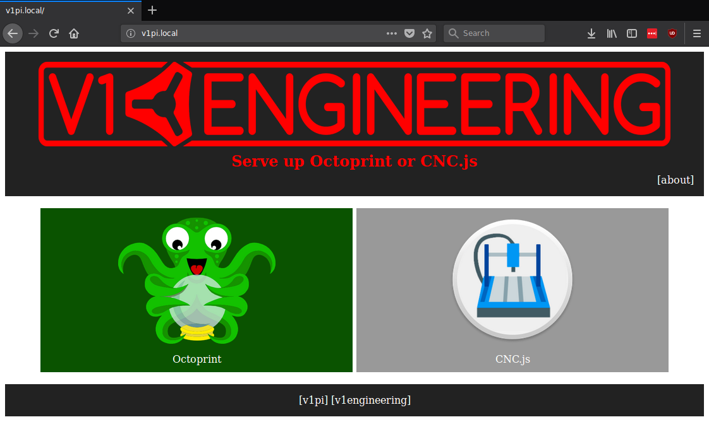

#############
V1PI
#############

What is it?
===========

It's an image for a raspberry pi, where I've configured as much as possible to help you get started
quickly making things with your `v1engineering.com <v1engineering.com>`_ machines.

Safety Notice
=============

Please be safe. CNC routers, even small ones, with tiny bits can make mistakes, and quickly end up
in a dangerous situation, causing a fire that can quickly grow to serious damage. **Don't leave your
machine unattended.** I am not responsible for anything you do, but I really don't want to hear about
any tragedies from someone using my software.

Set Up
======

Here are the short instructions:

 * Flash the SD with the `image <https://github.com/jeffeb3/v1pi/releases>`_
 * Edit the v1pi-wpa-supplicant.txt (not with notepad.exe)
 * Put it in a pi, and go to `http://v1pi.local <http://v1pi.local>`_

The longer instructions, including auto wifi hotspot, and a bunch more detail are here:

:doc:`setup`

More Information
================

Enjoy! Check out some of octoprint's plugins, load up some gcode from your desktop computer, attach
a webcam, etc.

Be sure to look at the (much more detailed) documentation from OctoPi, OctoPrint, and CNC.js:

 * OctoPi: https://octopi.octoprint.org/
 * OctoPrint: https://octoprint.org/
 * CNC.js: https://cnc.js.org/

More Documentation
==================

1. :doc:`setup`

1. :doc:`wifi-setup`

1. :doc:`camera-setup`
