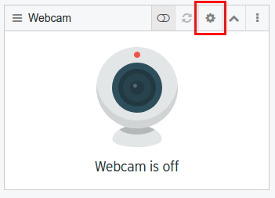
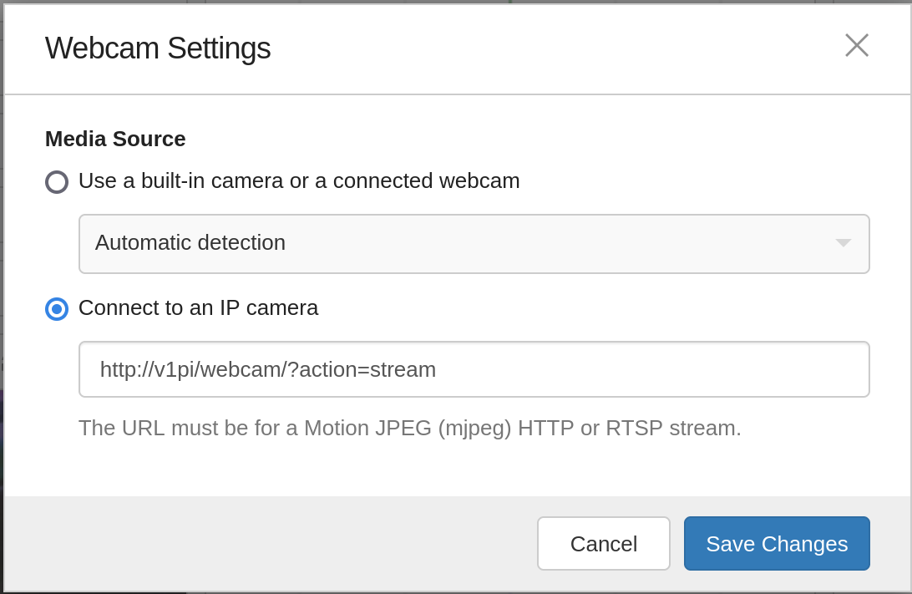

# Camera Setup

Use OctoPrint to get the camera working
=============

1. Use OctoPrint to get the camera working. This should really be as easy as connecting a camera via USB or a raspberry camera to the camera
port. When that's connected, reboot the pi, and look at the "Control" tab in OctoPrint. If that's
showing an image, then you're in good shape. If not, then you'll have to look at the OctoPrint
documentation or the v1engineering.com forums to see if you can find help.

Set up CNC.js settings
=============

1. In CNC.js, click the gear (for settings) in the Webcam widget.

2. Select "Use a M-JPEG stream over HTTP" option, and put this URL for your video stream: `http://v1pi/webcam/?action=stream`.
  - You may need to put in the IP address or add .local to v1pi to make it work for your network setup.

2. Click Save Changes.

3. Enable the camera with the enable toggle.

