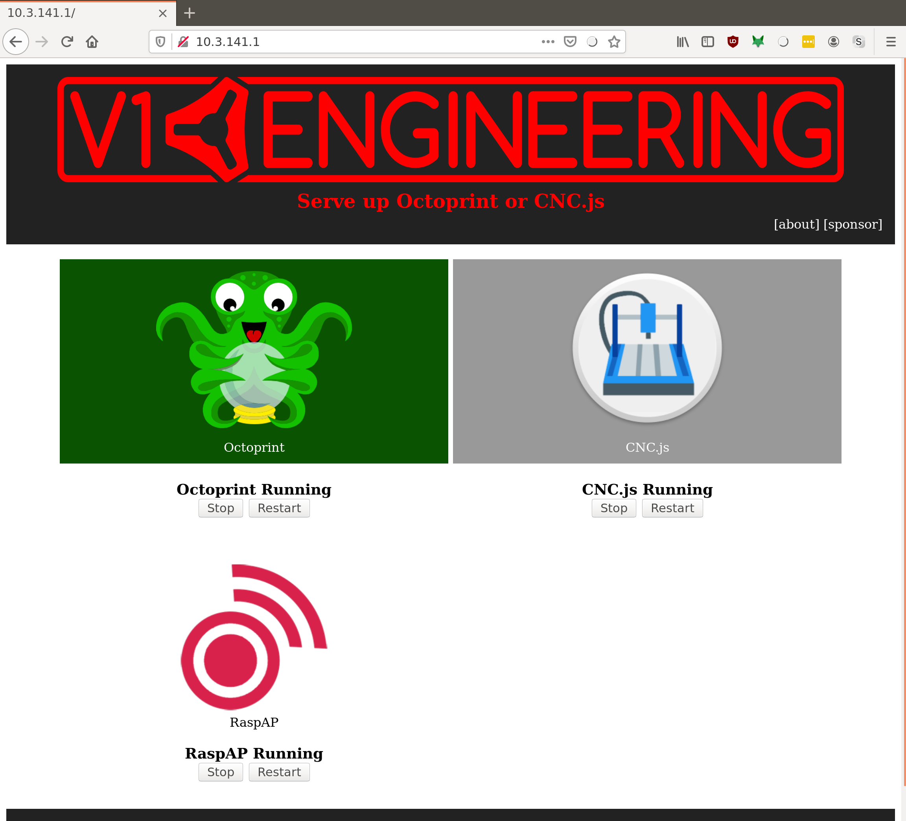

# V1PI

What is it?
===========

It's an image for a raspberry pi, where I've configured as much as possible to help you get started
quickly making things with your [v1engineering.com](http://v1engineering.com) machines.

Safety Notice
=============

!!! warning
    Don't leave your machine unattended!

Please be safe. CNC routers, even small ones, with tiny bits can make mistakes, and quickly end up
in a dangerous situation, causing a fire that can quickly grow to serious damage. **Don't leave your
machine unattended.** I am not responsible for anything you do, but I really don't want to hear about
any tragedies from someone using my software.

Equipment
======

As of v0.17.0, Raspberry Pi 4 is supported. This image doesn't include an X server, so it doesn't
need much memory or processor at all. The pi4 is really very quick and has enough head room to work
for this project and more.

Here are some affiliate links to parts:

[Raspberry Pi 4 Model B 2019 Quad Core 64 Bit WiFi Bluetooth (2GB)](https://amzn.to/2Ee9an1)

[MicroSD Memory Card](https://amzn.to/2LOhApq)

[Raspberry Pi 4 Power Supply (USB-C)](https://amzn.to/2EgMYc4)

A Raspberry pi 3B+ will work with wifi. I don't see any reason why older models won't, but I don't
have any in my supply anymore, and I won't be testing releases out on them.

A raspberry pi zero W is very attractive, but it is _right_ on the edge of working.

[Raspberry Pi Zero W (wireless) w/ PSU and 16GB SD](https://amzn.to/2YQGTwn)

If you have a pi without wifi, a wifi dongle that you have will probably work for the no-hotspot
version. But the one I have on a pi2b doesn't work with RaspAP. This is the dongle RaspAP suggests.
At $25, a new pi4 looks like a pretty solid alternative.

[Edimax EW-7811UN](https://amzn.to/2LPl5Mw)

Download
======

The latest releases are here.

https://github.com/jeffeb3/v1pi/releases

Which version
-------------

There are two versions:

1. Hotspot
1. No Hotspot

When possible, I try to accommodate people who don't have access to wifi where their v1 machine is.
So if you have barn with no wifi, then you can download the "hotspot" version, and the pi will make
it's own access point, or hot spot.

If you have wifi, or hard wired ethernet, then you don't need the hotspot.

The RaspAP web portal controls the hotspot (RASPberry Access Point). It's only in the hotspot
version.

Set Up
======

Here are the short instructions:

 * Flash the SD with the [image](https://github.com/jeffeb3/v1pi/releases)
 * Edit the v1pi-wpa-supplicant.txt (not with notepad.exe)
 * Put it in a pi, and go to [http://v1pi.local](http://v1pi.local)

The longer instructions, including wifi hotspot, and a bunch more [details are here](setup.md):

More Information
================

Enjoy! Check out some of octoprint's plugins, load up some gcode from your desktop computer, attach
a webcam, etc.

Be sure to look at the (much more detailed) documentation from OctoPi, OctoPrint, and CNC.js:

 * OctoPi: https://octopi.octoprint.org/
 * OctoPrint: https://octoprint.org/
 * CNC.js: https://cnc.js.org/
 * RaspAP: https://raspap.com

