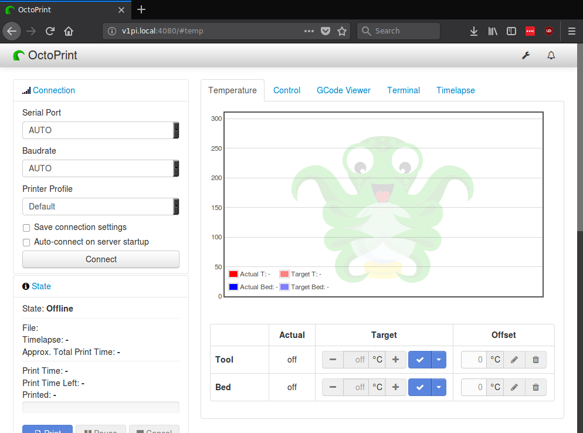
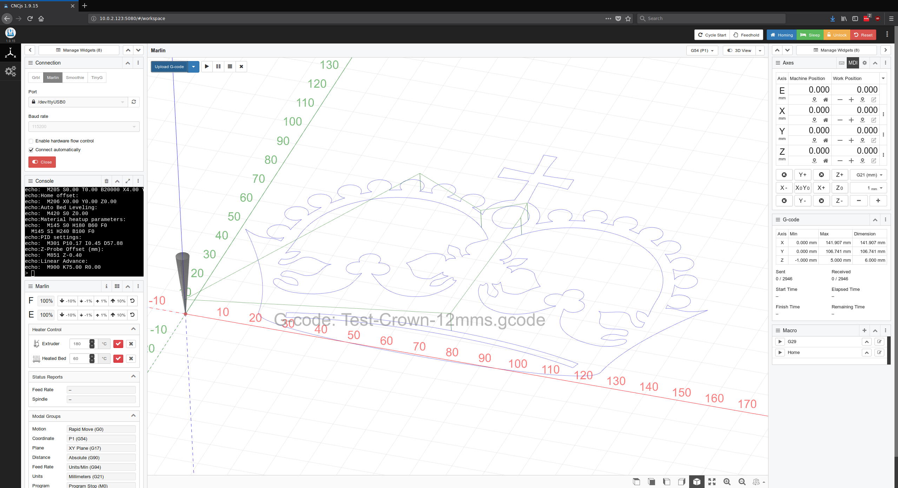
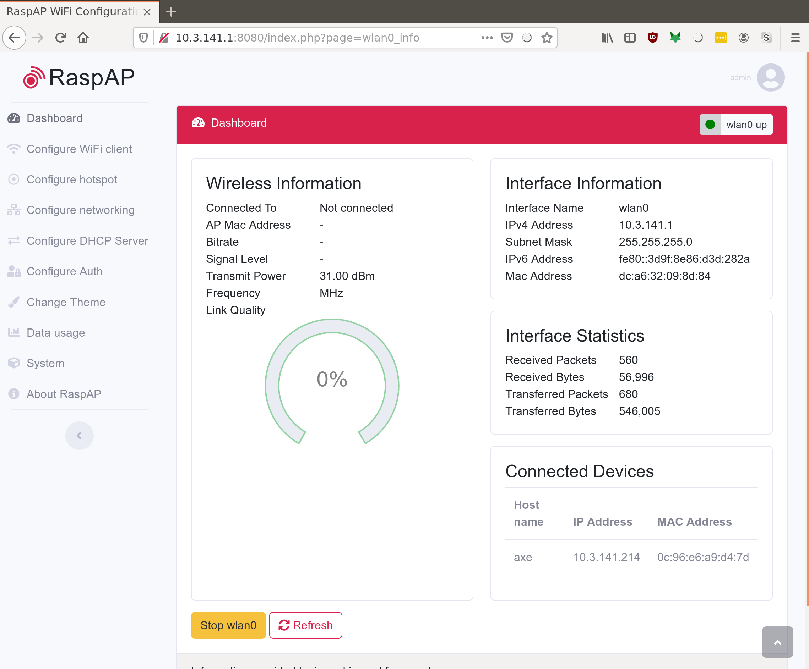
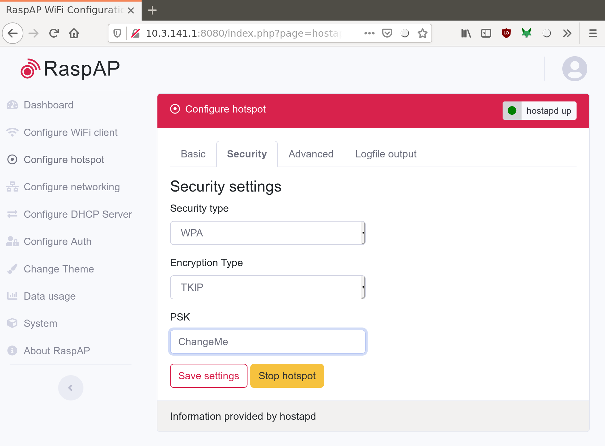

# Set Up

Let's Do It
===========

Great, let's flash an SD card with the image and get to making dust in the shop!

Step 1: Download the image
==========================

Download the most recent stable release from github: https://github.com/jeffeb3/v1pi/releases

Step 2: Copy the data to the SD card
====================================

The most general option is Etcher: [Get Etcher](https://etcher.io/)

More details: [Burn SD cards with Etcher](https://www.raspberrypi.org/magpi/pi-sd-etcher/)

Step 3: Configure WiFi (Optional)
=================================

If you don't want to connect this pi to your home WiFi network, then continue to the next step. If
you're not sure, or you want to connect to your home WiFi, look at [wifi-setup](wifi.md). Then come right back.

Step 4: Start it for the first time
===================================

Safely remove your SD card, or call umount/sync on Linux, and put the card in the pi. Connect the
printer and power it up.

The first time the pi boots, it will do some work to expand the filesystem to the full SD card size,
and generally setting things up. This takes a few minutes.

Step 5: Connecting
==================

Connect to Hot Spot
-------------------

!!! info
    - The default SSID is `v1pi`
    - The default Password is `ChangeMe`
    - The default ip is `10.3.141.1`. pi is 3.141.
    - The default username/password for RaspAP is `admin`/`secret`

* The Hot Spot will show up with an ssid of `v1pi` and a connection password of
  `ChangeMe`.
* Your computer might complain that you don't have an Internet connection. That's normal. The pi
  doesn't have Internet.
* If you connect with this method, the pi's ip address is `10.3.141.1`
* Open http://10.3.141.1
* The RaspAP UI has a username of `admin` and a password of `secret`.
* Change your password! See below.

Connect Through Your WiFi
-------------------------

* The pi will get it's IP address from your router. If you know how to find the IP address from your
  router, then you can do that, and put `http://<the ip address>` in your browser's address bar.
* The pi will also advertise it's address via http://v1pi.local

  * Macs: Just go there.
  * Linux (including other pi's): Install avahi-daemon, and then go there.
  * Windows: Check out Adafruit's guide
      [Here](https://learn.adafruit.com/bonjour-zeroconf-networking-for-windows-and-linux/overview)
  * Android: I haven't got a good way to do this from android, so I would `ping v1pi.local` from a
    computer, and see what address it's pinging, and put that in my android address bar.

* As a last resort, you can connect a monitor and keyboard. The pi will boot up to a login prompt.
  The prompt will print the different addresses that will let you connect to the pi.

Step 6: Use it
==============

The landing page will give you a few sparse links to information about this image, and two options:

* Octoprint: Very mature server for 3D printers. There are a lot of great features, and plugins, but
  it's use case is 99% 3D printing.

* CNC.js: Simple, CNC interface. The Marlin support is especially new, but I've been using it with
  grbl for a long time, and I love how simple and effective it is.

* RaspAP: Administration for the networking on the pi. Be careful, if you're editing this on the
  network and you break it, how will you reconnect to fix it? Also, make sure you change the
  passwords.

Step 7: Change the Passwords
============================

The default login password is raspberry, which the whole world knows. Even if you don't know how to
use the command line, other people do, and they can do nasty things to you. There are many many
things to do to improve security, but number one is to change the passwords.

Changing the SSH password
-------------------------

!!! info
    - The default username is `pi`
    - The default password is `raspberry`
    - It is common knowledge, you should really change it.

You'll need to log into the pi to change the password.

* Connecting with an ssh client is the easiest way, after you know the ip address.

  * Windows: putty.exe is an oldie and a goodie.
  * Mac/Linux: `ssh pi@v1pi.local`

* If you can't get ssh to work, you can also log in using a keyboard and monitor.
* The default username is `pi` and the default password is `raspberry`
* Change the password by running the `passwd` command.
* There is no root password set, so you don't have to change it. Any super user actions can be done
  as pi with the `sudo` command.

Changing the Hot Spot Password
------------------------------

The hot spot *default* password is `ChangeMe`. Any device within range can connect, and find your
pi, or the web interface, and control your pi, and your CNC machine. It gets worse if you think
about an infected device being in range, and not just a panel van with an antenna on it.

!!! warning
    Be really careful in the "Configure hotspot settings! It will sometimes change the interface,
    and if you save that, and restart, it will not show up again!

Changing the password is easy, and will help you sleep at night. OK, maybe not, but writing this
will help me sleep at night.

1. Open the webpage: http://10.3.141.1.

1. Click on `Configure hotspot`.

1. Click on `Security`.

1. Change the password in the `PSK` field.

1. Reboot the pi. The easiest way is the `reboot` button in the system menu of raspap.

Also in RapsAP, there is the webgui password. Change it in `Configure Auth`

Set up a Webcam
=========

If you want to set up a webcam, the instructions are here [Camera Setup](camera.md)

That's it
=========

