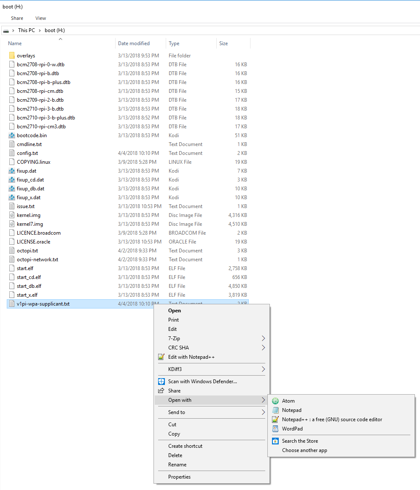
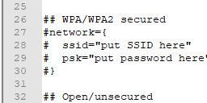
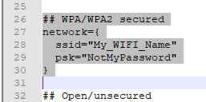

# WiFi Setup

Overview
========

v1pi has two ways to set up the WiFi:

 * Client: The pi will connect to your wifi router, get access to the Internet, and be accessible
   from any device on your WiFi network
 * Hot Spot: The pi will create an access point which your devices can connect to.

Hot Spot
========

??? "v1pi isn't showing up?"
    The Hot Spot is only in the images that say "hotspot.img". The "no-hotspot.img" does not have an
    access point, or wifi hot spot enabled.

    If you really wanted to add it, you can by following the instructions for RaspAP.

!!! info
    - The default SSID is `v1pi`
    - The default Password is `ChangeMe`
    - The default ip is `10.3.141.1`. pi is 3.141.
    - The default username/password for RaspAP is `admin`/`secret`

The Hot Spot feature will create a Hot Spot.

 * You don't have to do anything to set it up.

   * The default ssid is `v1pi`
   * The default passphrase is `ChangeMe`. See the setup instructions for how to change it.

 * If your machine is in a location without WiFi coverage, this is a good option.
 * The pi will not have any access to the Internet, so updates and installing plugins will not be
   possible. You will have to connect to the Internet to get updates or plugins.
 * The IP Address of the machine will be http://10.3.141.1. The bonjour hostname http://v1pi.local is
   also available.
 * Since there is no Internet connection, it is more protected from attacks.

??? "Trouble with WiFi Dongle and AP?"
    I have an older pi without builtin wifi, and the dongle I have shows up as v1pi, but it never
    connects. The 0W, 3B+, and 4 I have all work fine. RaspAP recommends this dongle if you need AP
    over a dongle:

    [Edimax EW-7811UN](https://amzn.to/33IjDRW)

Client Connection
=================

If the pi can connect to your house's WiFi, there are several benefits:

 * The machine can install plugins, and get updates because it's connected to the Internet.
 * No need to switch your computer between WiFi connections to get the Internet.
 * No need to worry about devices connecting to the Hot Spot of your CNC machine.

Configure the Client Connection
-------------------------------

The Client WiFi connection is controlled from `v1pi-wpa-supplicant.txt`
in the boot filesystem on the SD card. I prefer to edit the file before the first bootup.

The file contains instructions on how to edit it. For example, here are the parts I changed in
my configuration (the names have been changed to protect the innocent):

```
    network={
        ssid="Ryan"
        psk="Seacrest"
    }

    country=US
```

Edit wpa-supplicant in Windows
------------------------------

To edit the file in windows, after you've flashed the image using Etcher:

1. Don't reformat the drives you just flash, cancel this box:


2. Find the Boot partition.


3. Find the v1pi-wpa-supplicant.txt and edit it with an advanced text editor like notepad++ or atom.
   **Do not edit the file in Notepad**



4. Change the lines for your network setup.

* From:



* To:



